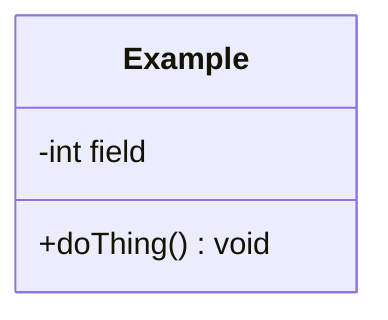

# Design — <your project name>

## What problem is this solving?

<One or two sentences. Plain English. No code.>

## The objects

<For each class: what is its single responsibility? One sentence each.>

| Class | Responsibility |
|---|---|
| | |

## Class diagram

## What I am unsure about

<Anything you could not decide. This is graded as honesty, not weakness.>
